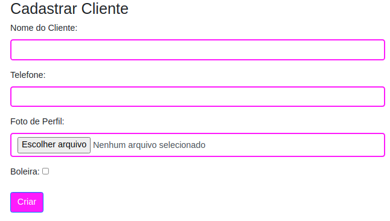
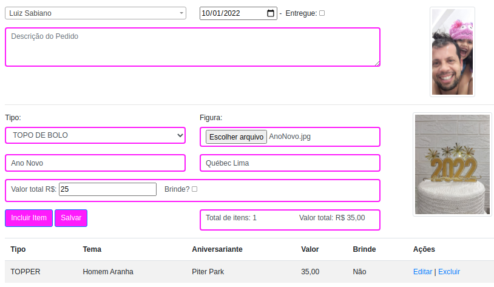
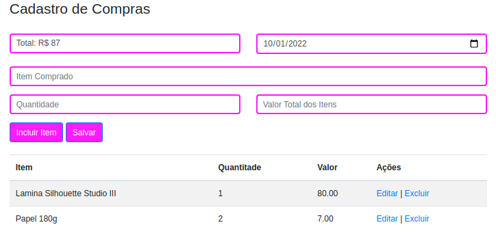
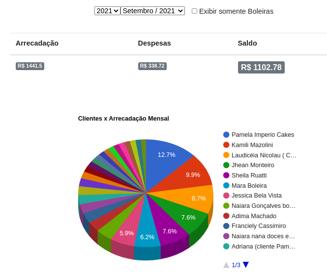
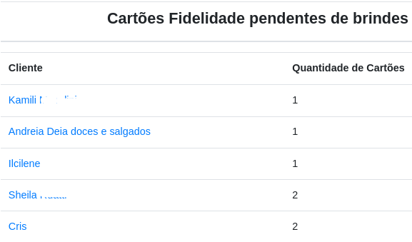

# Handicraft Order Control

Este é um aplicativo criado para minha belíssima esposa, artesã, com o intuito incial de gerenciar pedidos e controle financeiro.

#### *Por que um aplicativo para este fim?*

1. A existência de diversos meios possíveis em que os clientes realizavam orçamento/pedidos como whatsapp, messenger, etc, somado a datas diferenciadas para entrega geravam retrabalho devido a exaustivas buscas em apps diferentes a procura de detalhes ou da data de entrega de determinado pedido.
2. Descontrole orçamentário, não existia até então nada que controlasse as entradas e saídas de valores, dessa forma perguntas como, quanto foi arrecadado no mês vigente ou quanto foi gasto com materiais não podiam ser respondidas.
3. O controle de pagamentos dos clientes eram anotações feitas em cadernos, que necessitavam de revisões constantes sem nenhum sistema de busca aprimorado.

#### *O que foi feito?*

Para satisfezer as necessidades acima foi implementado:

## Cadastro de clientes

* Nome,
* Telefone,
* Foto,
* Boleira. 

Esta opção de "Boleira", confeira de bolos, é necessidade específica para minha esposa. Havia uma necessidade de identificar pedidos de boleiras pois estas forneciam alta demanda de pedidos, desta forma além efetuarem pagamentos posteriores também recebiam brindes após uma determinada quantidade de pedidos.

 

---

## Cadastro de Pedidos

* Cliente,
* Data da entrega,
* Se já foi entregue,
* Descrição do pedido,
* Tipo (lista pre-estabelecida de valores, topo de bolo,caixas decorativas, tagas...),
* Imagem da arte,
* Tema,
* Nome do aniversariante ( pode ser qualquer um comtemplado com a festa),
* Valor,
* Brinde ( Caso já possua a quantidade de adesivos necessários).

 

---

## Cadastro de Compras

* Somatório dos itens,
* Data da Compra,
* Item comprado,
* Quantidade,
* Valor total
 

---

## As alterações

Todas os formularios de alterações aproveitam os formulários dos cadastros não sendo necessário apresentá-los.

---

## As exclusões

De forma semelhante, as exclusões aproveitam os formulários dos cadastros porém com os campos não editáveis. Após clicar em excluir é necessário outra confirmação para que a exclusão seja realizada.

---

## Home / Página Inicial

A página inicial apresenta um gráfico com os valores de entrada e saída e o saldo do mes vigente. É possível alterar o mês e visualizar meses anteriores.
De tempo em tempo o gráfico alterna com o relatório de clientes que já comtemplaram o cartão fidelidade e ainda não receberam brindes.

 
### Slide 1

  

### Slide 2
 

